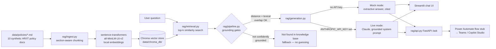

# GenAI + Power Platform Knowledge Assistant

A local, testable RAG (Retrieval-Augmented Generation) pipeline that answers HR/IT
policy questions from a company's own documents — paired with a documented Power
Automate integration stub, because the differentiator this project is built to
demonstrate isn't "can build a RAG chatbot" (increasingly table stakes), it's **"can
build a RAG chatbot *and* knows how it actually reaches an employee through Teams/
Copilot Studio in a real enterprise rollout."**

**Why this project exists:** this is the second of two portfolio projects built for
Singapore Data & AI Presales / Solutions Engineer applications. The first
([`sg-data-ai-demo`](../sg-data-ai-demo)) covers the SQL/Python/ML/dashboard baseline
that shows up in nearly every relevant posting (Azendian, NTT DATA, Accenture,
Databricks). This one targets the newer, faster-growing line item in the same
postings: GenAI/LLM skills combined with Microsoft Copilot/Power Platform integration
— a combination that's rare precisely because most candidates have one side or the
other, not both. The candidate's real Power Platform delivery background (Job
Movement Platform, Employee Verification Application, HR workflow automation at
Teleperformance) is what makes the Power Automate half of this credible rather than
decorative.

---

## The business narrative

> Meridian Holdings (fictional) is a mid-size company with HR/IT teams that field the
> same repetitive policy questions every day — leave balances, expense deadlines, IT
> equipment requests. This assistant answers them instantly from the company's actual
> policy documents, with citations, instead of routing every question to a human — and
> it says "I don't know" instead of guessing when a question falls outside what the
> policies actually cover.

All 10 policy documents in `data/policies/` are synthetic and fictional. No real
company, employer, or client policy is used anywhere in this project.

---

## Architecture



Two things worth noting about this diagram versus a typical RAG tutorial:
1. There's a **grounding gate between retrieval and generation** (`rag/pipeline.py`),
   not just a single distance threshold — see [Honest failure case](#honest-failure-case--what-i-caught-and-fixed) below for why.
2. The same pipeline is exposed through **three** surfaces (Streamlit, FastAPI, and — via
   the FastAPI layer — a Power Automate flow), not just a chat UI, because the FastAPI
   layer is what a real Teams/Copilot Studio deployment would actually call.

---

## Tech stack, and why

| Component | Choice | Why |
|---|---|---|
| Orchestration | **LangChain** (not LlamaIndex) | Both are fine choices for this scale of project. LangChain was picked because its `Chroma`/text-splitter/embeddings integrations are slightly more battle-tested for a "local, no-cloud-dependency" setup, and because LangChain shows up more often by name in the SG job postings this project maps against (see table below) — worth being fluent in the tool that's actually asked for. |
| Vector store | **Chroma** | Runs embedded/local with zero external service — no hosted vector DB account needed to run this demo. |
| Embeddings | **sentence-transformers (`all-MiniLM-L6-v2`)** | Free, local, no API key. This is the thing that makes the whole pipeline testable with **zero cost and zero signup** — a deliberate requirement from the project spec. |
| Generation (mock) | Extractive, no LLM call | Default mode. Quotes retrieved chunks directly rather than paraphrasing them, so there's no risk of the "generation" step introducing an unsupported claim. |
| Generation (live) | **Anthropic Claude** (`claude-haiku-4-5`) | Optional. Requires `ANTHROPIC_API_KEY` in `.env` — never hardcoded. Cheap/fast model is enough for a policy-Q&A PoC. |
| Chat UI | **Streamlit** | Matches the first portfolio project's dashboard stack, fast to build and demo live. |
| Service layer | **FastAPI** | The thing Power Automate would actually call over HTTP in a real deployment — see `power_automate/`. |

---

## Quick start (2 minutes, no API key needed)

```bash
cd genai-power-platform-agent
python3 -m venv .venv && source .venv/bin/activate
pip install -r requirements.txt

python -m rag.ingest              # chunks + embeds the 10 policy docs into Chroma (local, free)
python -m eval.run_eval           # runs the 20-question evaluation set, writes eval/eval_results.md
streamlit run app/streamlit_app.py
```

This runs entirely in **mock mode** — no `ANTHROPIC_API_KEY` required, no paid API
calls made anywhere in the pipeline. Mock mode returns the retrieved policy text
directly (with citations) rather than an LLM paraphrase, which is precisely why it's
a safe default: it cannot hallucinate a fact that isn't in the source text.

### Enabling live mode (optional)

```bash
cp .env.example .env
# then edit .env and set:
# ANTHROPIC_API_KEY=sk-ant-...
```

With a key set, the Streamlit sidebar and the `/ask` API both default to live mode,
which calls Claude with a system prompt that restricts it to the retrieved context and
instructs it to say so explicitly when the context doesn't cover the question (see
`rag/generation.py::SYSTEM_PROMPT`). This project's own evaluation run (see below) was
executed in mock mode — live mode was implemented and is wired end-to-end, but wasn't
API-tested against a real key while writing this up, so treat it as implemented-not-benchmarked
rather than "the numbers below reflect live mode."

### Running the FastAPI service (what Power Automate calls)

```bash
uvicorn rag.api:app --host 0.0.0.0 --port 8000
curl -s -X POST http://localhost:8000/ask \
  -H "Content-Type: application/json" \
  -d '{"question": "How many days of annual leave do I get?"}'
```

---

## Evaluation

`eval/eval_questions.json` has 20 hand-written questions: 18 in-scope (covering all 10
policy documents) and 2 deliberately out-of-scope. `eval/run_eval.py` scores three
things and writes the full per-question breakdown to `eval/eval_results.md`:

- **Retrieval accuracy** — does the expected source document show up in the top-k
  retrieved chunks?
- **Keyword grounding accuracy** — does the generated answer actually contain the
  expected fact (not just cite the right document)?
- **Correct refusal rate** — for the 2 out-of-scope questions, does the pipeline
  correctly say "not found" instead of fabricating an answer from irrelevant chunks?

Latest run (mock mode):

| Metric | Result |
|---|---|
| Retrieval accuracy | 100% (18/18) |
| Keyword grounding accuracy | 100% (18/18) |
| Correct refusal rate (out-of-scope) | 100% (2/2) |
| Hallucination flags raised | 0 |

Full per-question table: [`eval/eval_results.md`](eval/eval_results.md).

---

## Honest failure case — what I caught and fixed

This project's counterpart in the first PoC caught a data-leakage bug in the churn
model (`recency_days` was both a feature and the literal basis of the label). The
equivalent story here:

**The bug.** The first version of the grounding check was a single rule: if the best
retrieved chunk's vector distance is below a threshold, answer; otherwise say
"not found." Running the eval set against that version, one of the two deliberately
out-of-scope questions — *"What's Meridian Holdings' stock buyback policy for
shareholders?"* — **passed the distance threshold (0.99, under the 1.05 cutoff) and
got answered anyway**, stitching together unrelated chunks from the Expense Claims and
Performance Review policies. Nothing in either document has anything to do with stock
buybacks; the question just happened to share enough incidental phrasing ("Meridian
Holdings", formal policy tone) with the corpus's boilerplate that it looked
close enough in embedding space.

**Why it happened.** Every policy document repeats the same header boilerplate
("Meridian Holdings", "Document owner", "Applies to: All ... employees"). That
boilerplate is enough shared vocabulary to pull an off-topic question's embedding
distance below a naive single-threshold cutoff, even though the actual *topic* of the
question — stock buybacks — appears nowhere in the corpus.

**The fix.** `rag/pipeline.py::_is_lexically_grounded` adds a second gate after the
distance check: it strips shared boilerplate words from both the question and the top
chunk, and requires at least one real, non-boilerplate content word to overlap between
them. Re-running the eval after this fix: correct refusal rate went from 50% → 100%,
hallucination flags from 1 → 0, with no drop in retrieval or keyword accuracy on the
in-scope questions. (A first version of this fix had its own bug — normalizing
"laptops" vs "laptop" inconsistently caused a false rejection on an in-scope
question — caught by re-running the eval set after the change and fixed by
normalizing the boilerplate list the same way as the input text.)

**The honest limitation that remains.** The distance-only gate can still under-answer
on genuinely ambiguous questions. Asking *"Can I work from Bali for a month?"* (not in
the scored eval set — tested separately) returns the not-found fallback, even though
the Remote & Hybrid Work Policy's "Working from overseas" section is topically
relevant (it caps cross-border remote work at 20 working days/year). The question's
specific framing — a place name and a casual time unit ("a month") — sits far enough
in embedding space from the policy's own wording (working days, cross-border remote
work request) that it doesn't clear the distance threshold. **The mitigation is the
same fallback message, and that's a deliberate trade-off, not an oversight**: this
system is tuned to under-answer rather than confidently answer with a citation that
doesn't actually settle the question — false "I don't know" is a much cheaper failure
than a fabricated policy detail on something like leave entitlement or reimbursement.

---

## Power Automate integration

See [`power_automate/README.md`](power_automate/README.md) and
[`power_automate/rag_flow_definition.json`](power_automate/rag_flow_definition.json)
for the full walkthrough: a documented (hand-written, schema-accurate) Power Automate
flow definition showing how a Teams channel message or a Copilot Studio topic would
call `rag/api.py`'s `/ask` endpoint and post the answer back as an Adaptive Card with
citations. It is explicitly documented as **not deployed** — no licensed Power Platform
environment was available to export and test a real flow package against — but the
one component that is real and runnable is the FastAPI service itself.

---

## Mapping this project to what employers actually ask for

| Job requirement (from real SG postings) | Where it's shown here |
|---|---|
| "Experience with GenAI/LLM concepts (RAG, embeddings, prompt engineering)" — increasingly common across Azendian, NTT DATA, Accenture Presales postings | `rag/ingest.py`, `rag/retrieval.py`, `rag/generation.py` |
| "Microsoft Copilot Studio / Power Platform integration" — a growing line item as enterprises push Copilot adoption | `power_automate/` |
| "Ability to build PoCs and communicate technical trade-offs to business stakeholders" | The honest-failure-case section above, and the mock/live mode split |
| "Python, evaluation/testing discipline for AI systems" | `eval/run_eval.py`, `eval/eval_questions.json` |
| "Hands-on with vector databases / modern data platforms" | Chroma integration in `rag/ingest.py` |

---

## What's not done / possible extensions

- Live mode is implemented but not benchmarked against a real Anthropic API key in
  this write-up (no key was used to avoid incurring cost while building) — the honest
  thing to say is "wired end-to-end, mock-mode-verified."
- The lexical grounding gate is a heuristic, not a learned relevance classifier — it
  would not scale cleanly to a much larger, more topically diverse corpus. A production
  version would likely replace it with a lightweight cross-encoder reranker.
- No conversation memory — each question is answered independently, which is fine for
  single-turn HR/IT lookups but wouldn't handle a genuine multi-turn follow-up ("what
  about for Malaysia-based staff?") gracefully.
- Natural extension: connect this same corpus/pipeline to the RetailPulse dataset from
  the first project — e.g. "why is customer X flagged as high churn risk?" answered in
  plain language, grounded in that project's actual scored data instead of static docs.

---

## Disclaimer

All policy documents, company names, and evaluation questions in this repository are
synthetically generated for demonstration purposes. No real company, employer, or
client policy or data is used anywhere in this project.
