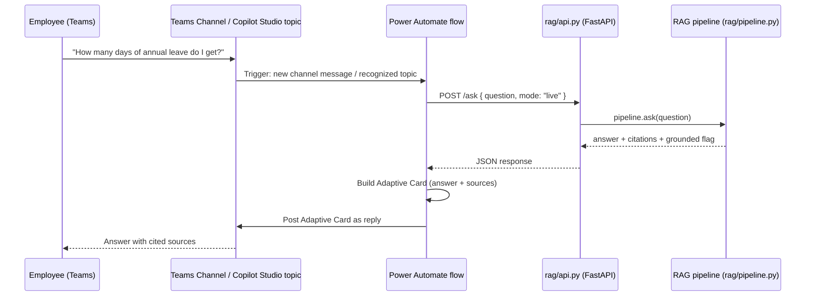

# Power Automate / Copilot Studio Integration Stub

## Why this exists

The whole point of pairing this project with the candidate's Power Platform background
(Job Movement Platform, Employee Verification Application, and general Power Automate/
Copilot Studio delivery experience at Teleperformance) is to show the *last mile* that a
lot of GenAI portfolio projects skip: **how does a RAG service actually reach an
end-user inside the tools a real enterprise already uses (Teams, Copilot Studio)?**

This folder documents that integration. It is **not a deployed flow** — the candidate
does not currently have access to a licensed Power Platform environment to export a
real flow package from. Instead, [`rag_flow_definition.json`](rag_flow_definition.json)
is a hand-written Workflow Definition Language document in the same shape Power Automate
uses internally (`definition.json` inside an exported flow `.zip`), so the design is
concrete and reviewable rather than just described in prose.

## What the flow does



## Two ways to trigger this in a real deployment

1. **Direct Teams channel trigger** (what's modeled in the JSON): a Power Automate flow
   triggered on `When a new message is added to a channel`, filtered to messages in an
   "Ask HR/IT" channel.
2. **Copilot Studio topic** (the more realistic enterprise pattern, and the one worth
   describing in an interview): a Copilot Studio bot has a topic that captures the
   employee's question as an entity, then calls this same flow as a Power Automate
   action from within the topic, and renders the returned answer + citations back into
   the Copilot Studio conversation. This is a straightforward swap of the trigger block
   in `rag_flow_definition.json` — the `Call_RAG_service` → `Parse_RAG_response` →
   `Build_adaptive_card` chain is unchanged either way, since it doesn't care where the
   question text came from.

## Running the piece that actually exists

The one part of this integration that *is* real and runnable is the HTTP service the
flow calls:

```bash
source .venv/bin/activate
uvicorn rag.api:app --host 0.0.0.0 --port 8000
```

```bash
curl -s -X POST http://localhost:8000/ask \
  -H "Content-Type: application/json" \
  -d '{"question": "How many days of annual leave do I get?"}'
```

In a real deployment, `ragServiceBaseUrl` (a parameter in the flow definition) would
point at wherever this FastAPI service is actually hosted — e.g. an Azure Container
App, App Service, or an internal Kubernetes service — instead of `localhost`.

## Honest gaps in this stub

- The `shared_teams` connection references in the JSON are placeholders — a real flow
  needs an actual Teams connector authorized against a tenant, which requires a
  licensed Microsoft 365/Power Platform environment this project doesn't have access to.
- Authentication between the flow and the FastAPI service is not modeled here (no API
  key/OAuth on the `Call_RAG_service` action). A production version would put this
  service behind Azure API Management or add a shared-secret header, not expose it
  unauthenticated.
- This has not been imported into an actual Power Automate designer and validated —
  it's a faithful, hand-written approximation of the schema, not a tested export.
