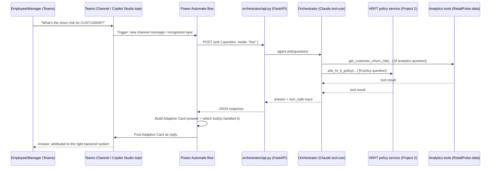

# Power Automate / Copilot Studio Integration Stub

## Why this one is different from Project 2's

Project 2's stub proved the *shape* of the integration: a Power Automate flow calling
a FastAPI service, posting an Adaptive Card back to Teams. This one proves the
*reuse* — the exact same shape now fronts a copilot that spans two backend domains
(HR/IT policy and customer analytics) instead of one, and the flow definition doesn't
change at all to accommodate that. The routing complexity is entirely inside the
copilot; Power Automate's job stays exactly as simple as it was for a single-purpose
service.

As with Project 2: this is a hand-written, schema-accurate Workflow Definition
Language document, **not exported from a live Power Platform environment** (still no
licensed environment available to do that). See the honest gaps section below.

## What the flow does



## Running the piece that actually exists

```bash
# Terminal 1 — the HR/IT policy service this copilot depends on:
cd ../genai-power-platform-agent
source .venv/bin/activate
uvicorn rag.api:app --port 8000

# Terminal 2 — the Ops Copilot's own service:
cd ../ops-copilot-agent
source .venv/bin/activate
uvicorn orchestrator.api:app --port 8100
```

```bash
curl -s -X POST http://localhost:8100/ask \
  -H "Content-Type: application/json" \
  -d '{"question": "What is the churn risk for CUST100005?"}'
```

## Honest gaps in this stub

- Same `shared_teams` connection placeholder issue as Project 2 — needs a real,
  licensed Teams connector to actually deploy.
- No auth between the flow and either FastAPI service — same production caveat as
  Project 2 (would need API Management or a shared secret, not exposed unauthenticated).
- This flow now has a *dependency chain*: Power Automate → Ops Copilot service →
  (sometimes) the HR/IT policy service. In a real deployment this ordering/availability
  dependency would need its own monitoring — if the policy service is down, the
  copilot's `ask_hr_it_policy` tool call fails gracefully (see
  `tools/policy.py::ask_hr_it_policy`), but that failure mode isn't modeled in this
  flow definition itself.
