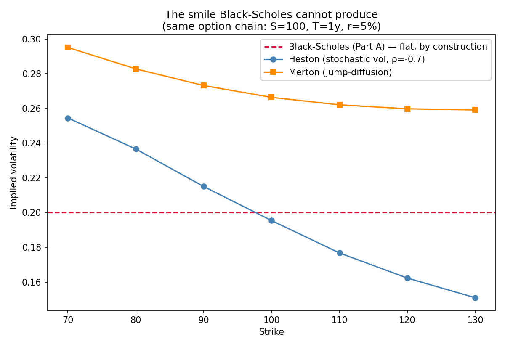
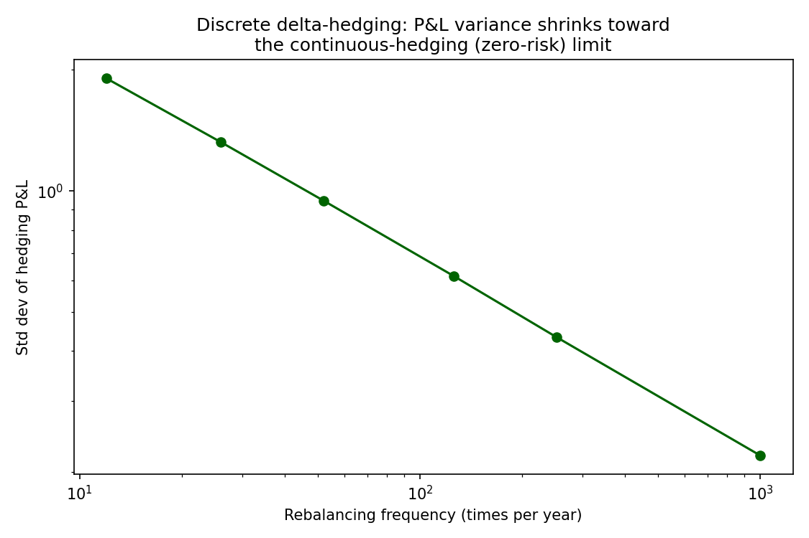

# Part B — Beyond Black-Scholes

Part A's five pricers all share one assumption: constant volatility,
continuous costless hedging. This part exists to show, concretely, where
that assumption breaks — not just to state that it does.

## The smile Black-Scholes cannot produce

`heston.py` (stochastic volatility) and `merton_jump_diffusion.py`
(jump-diffusion) are two genuinely different mechanisms for departing from
Black-Scholes, priced on the *same option chain* (S=100, T=1y, r=5%) as Part
A's worked examples, specifically so the comparison is direct:



- **Black-Scholes (Part A)** is flat by construction — one sigma, every strike.
- **Heston** (ρ=-0.7, the standard equity "leverage effect" assumption —
  volatility rises when the asset falls) produces a monotonic downward skew:
  25.4% implied vol at K=70 down to 15.1% at K=130.
- **Merton jump-diffusion** produces a smile of a different shape — both
  wings priced above the center, because a small constant probability of a
  sudden jump matters more to far-OTM strikes than to the money.

Both are real curvature the same closed-form BS pricer from Part A cannot
produce at any single sigma — the whole point of this comparison.

### Heston (`heston.py`)

Standard risk-neutral SDEs: `dS = rS dt + sqrt(v) S dW1`, `dv = kappa(theta -
v) dt + xi sqrt(v) dW2`, correlated `dW1, dW2` with correlation `rho`. Priced
by Monte Carlo (no closed form used here, unlike Merton below).

**Simulation scheme, stated honestly**: variance is simulated with the "full
truncation" Euler scheme (Lord, Koekkoek & van Dijk, 2010) — negative
variance values that plain Euler discretization can produce are floored to
zero before use. This is simple and standard, and adequate for demonstrating
the smile; a production Heston pricer would use the exact characteristic-
function (Fourier/Carr-Madan) price instead, which has no discretization bias.

`tests/test_heston.py` checks the smile is real: implied vols must actually
differ by more than 3 vol points across strikes (not implement-and-hope),
and must be monotonically *decreasing* with strike given a negative `rho`
(the correct qualitative sign, not just "some curvature").

### Merton jump-diffusion (`merton_jump_diffusion.py`)

Unlike Heston, this has a genuine **closed form** — a Poisson-weighted sum of
Black-Scholes prices, one term per possible jump count, each with an adjusted
effective volatility and drift. `tests/test_merton.py` checks the single most
important correctness property directly: **with jump intensity set to zero,
the formula must reduce *exactly* (not just approximately) to Black-Scholes**
— a real algebraic identity, not a numerical coincidence, and the strongest
sanity check available for this implementation.

## Discrete delta-hedging — the mechanics question, made concrete

Black-Scholes' "you can perfectly replicate an option" result assumes
continuous, costless rebalancing. `delta_hedging.py` simulates an option
seller who instead rebalances at realistic discrete intervals, and measures
the resulting hedging P&L variance — a classic "do you actually understand
the mechanics" interview question, made into a real, runnable simulation
rather than left as a verbal claim.



| Rebalances/year | Hedging P&L std dev |
|---|---|
| 12 (monthly) | 1.90 |
| 52 (weekly) | 0.95 |
| 252 (daily) | 0.43 |
| 1000 | 0.22 |

P&L std dev falls roughly by half every time rebalancing frequency roughly
quadruples — a straight line on the log-log plot above, matching the
theoretical result that discrete-hedging error variance is O(Δt), so its
standard deviation scales as O(1/√n). Mean P&L stays close to zero at every
frequency (the hedge is unbiased; it's the *variance*, not the mean, that
discrete rebalancing fails to control) — `tests/test_delta_hedging.py` checks
both the monotonic variance reduction and the approximate 1/√n scaling
directly, not just the shape of the plot.

## Running the tests and regenerating the figures

```bash
pip install -r requirements.txt
python -m pytest tests/test_heston.py tests/test_merton.py tests/test_delta_hedging.py -v
python -m advanced_models.generate_figures
```
