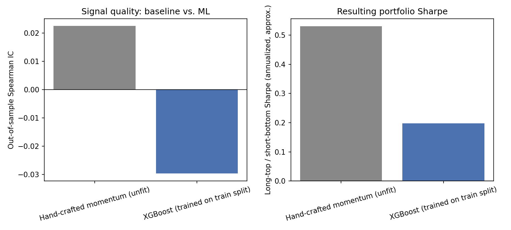
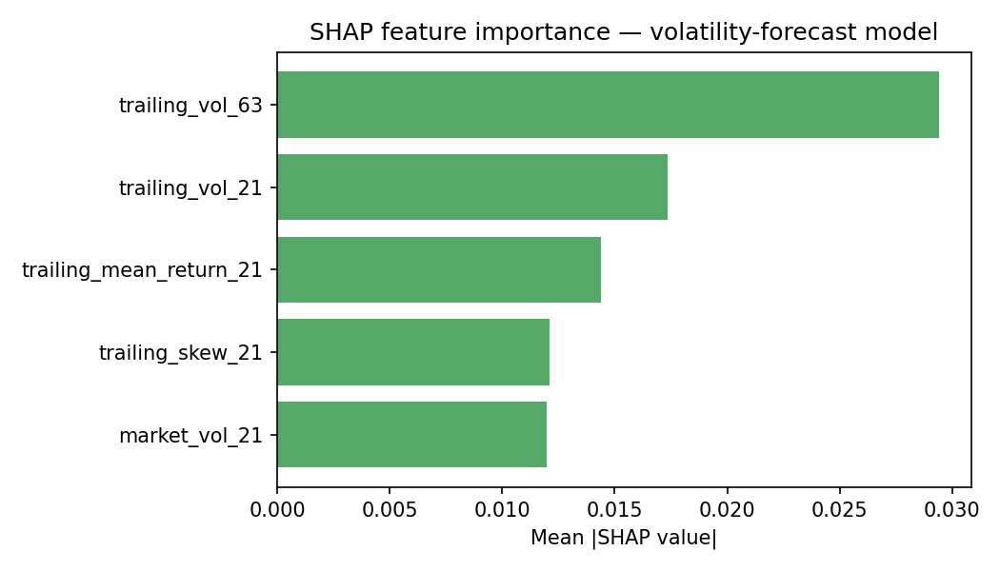

# Part E — AI-Augmented Quant Research (the differentiator)

This module exists because of a specific piece of 2026 Singapore/APAC hiring
research: the most differentiated and best-paid quant profile isn't "does
classical derivatives math well" — that's a crowded field of math-PhD
candidates — it's candidates who **combine AI/ML engineering with quant
rigor**, because systematic trading firms are actively building in-house AI
capability for signal generation, model interpretability, and risk tooling.
Parts A-D of this toolkit prove classical quant fundamentals; this part
proves the AI-engineering half of that combination, on the same real market
data pipeline built for Part D.

Three pieces, each targeting a specific line from that hiring research:

| Sub-module | Targets |
|---|---|
| `signal_model.py` | "ML-based signal generation" |
| `interpretability.py` + `risk_model.py` | "model interpretability" |
| `research_assistant/` | applied LLM/RAG engineering, reused from the GenAI portfolio project |

---

## 1. ML-based signal generation — and an honest result

`features.py` builds a factor panel (21d/63d momentum, 21d realized
volatility, 5d reversal, 21d relative strength vs. SPY) from the same price
data Part D uses. `signal_model.py` compares two models predicting 5-day
forward returns from those factors:

- **A genuinely simple, hand-crafted, unfit baseline**: raw `mom_21 + mom_63`,
  no parameters estimated from data at all — it cannot overfit by construction.
- **XGBoost**, trained on a chronological 70/30 train/test split (never
  shuffled — a random split would leak future information into training,
  since the same dates appear across multiple tickers).

Both are scored out-of-sample the same way: Spearman rank correlation (IC)
between the signal and the actual forward return, and the Sharpe ratio of a
simple daily long-top/short-bottom-ticker spread.



| Model | OOS IC | IC p-value | Long/short Sharpe |
|---|---|---|---|
| Hand-crafted momentum (unfit) | +0.023 | 0.40 | 0.53 |
| XGBoost | **-0.030** | 0.26 | 0.20 |

**The honest result: the ML model does not beat the simple baseline here.**
Its out-of-sample IC is slightly negative, and its resulting long/short
Sharpe is less than half the baseline's. Reporting this straight, rather than
tuning the comparison until XGBoost wins, is deliberate — this is a common
and worth-reporting real-world outcome in signal research, not a failure to
hide. Two honest caveats on *why*, both real limitations rather than excuses:

1. **The universe is tiny.** Four tickers is nowhere near enough for a
   cross-sectional long/short signal to show its hand — neither result here
   is statistically significant at conventional levels (both p-values are
   well above 0.05). This comparison is a methodology demonstration, not a
   claim that either signal works.
2. **Five years of daily data for four names is a genuinely small training
   set for a gradient-boosted model**, which has far more capacity to overfit
   noise than a two-term linear rule. That XGBoost *doesn't* dominate here is
   consistent with a well-known pattern in empirical factor research: more
   model flexibility doesn't reliably beat a simple, robust rule on scarce,
   noisy financial data — a lesson that argues for the diagnostic honesty
   this whole toolkit is built around, not against building the ML pipeline.

## 2. Model interpretability (SHAP)

Applied to **two** models, deliberately not just the flashy one:

**The return-signal XGBoost model** (`ai_augmented/figures/shap_signal_importance.png`):
63-day momentum and 21-day volatility carry the most weight. Worth stating
plainly: SHAP explains what a model is *using*, not whether what it's using
is predictive — this model's feature ranking is coherent, but the model
itself doesn't beat the baseline (see above). Interpretability and
performance are two different questions.

**A volatility-forecasting model**, purpose-built as the interpretability
target for the risk side of this module (`risk_model.py`) — SHAP can't be
meaningfully applied to the VaR formulas in `risk/var.py` directly, since
those are closed-form/empirical-quantile calculations with no fitted
parameters to attribute. A fitted volatility forecaster is the natural
supervised-model stand-in for "explain what's driving this portfolio's risk":



Trailing 63-day and 21-day realized volatility dominate the prediction of
*forward* 21-day volatility — the model has essentially rediscovered
**volatility clustering**, one of the best-documented stylized facts in
financial time series (high-vol periods are followed by more high-vol
periods). That the SHAP output reproduces a well-known real phenomenon,
rather than something arbitrary, is itself a sanity check that the model
learned something real rather than noise. Out-of-sample R² is a modest 0.15
— positive and plausible for a genuinely hard forecasting problem, not
suspiciously close to 1.0 (which would suggest a leakage bug).

## 3. LLM research assistant — reusing the RAG pattern, same honesty standard

`research_assistant/` is architecturally the same pattern as the
`genai-power-platform-agent` HR/IT assistant (embed → retrieve → generate,
mock mode by default with an optional live Anthropic call, and a
similarity-threshold not-found fallback) — reimplemented here rather than
imported, so this repo doesn't take a hard runtime dependency on a sibling
project. One simplification, stated honestly: with a corpus this small (a
dozen short synthetic research notes), an in-memory cosine-similarity search
over sentence-transformer embeddings does the same job as a vector database;
Chroma's advantage shows up at a scale this demo doesn't need.

**This is a research-idea generator, not a source of truth — explicitly and
repeatedly, not just in this README.** The system prompt itself instructs the
model to frame every answer as "the notes suggest," never as verified fact,
and to end every response with a reminder that this is a starting point for
research, not investment advice. Retrieval is calibrated the same way as the
HR assistant: cosine similarity ≥ 0.30 triggers an answer, below that
triggers an explicit "I don't have anything relevant" response rather than a
guess — calibrated against real queries (in-scope questions scored 0.42-0.66;
genuinely out-of-scope ones like "cryptocurrency regulation" or "the weather
in Singapore" topped out at 0.27, a clean separation).

**Failure modes, stated explicitly (same honesty standard as the original
HR/IT assistant project):**
- **Hallucination risk in live mode.** An LLM asked to synthesize across
  multiple notes can still produce a plausible-sounding but unsupported
  claim, even with a strict system prompt. Nothing in this pipeline
  verifies live-mode output against the source notes after generation.
- **Corpus coverage is synthetic and tiny (12 notes).** It cannot answer
  anything outside those 12 topics, and — because the notes are fictional,
  written for this project — even correct-sounding retrieval and generation
  is not grounded in real market events. This is a methodology demo, not a
  research tool to point at real capital decisions.
- **No source verification.** A production version would need to check
  retrieved notes against real, dated, sourced filings/news — this version
  trusts the corpus at face value.
- **Human validation is required before any output here informs an actual
  decision.** The tool's own system prompt says this on every answer; this
  README says it again on purpose.

## Running the tests and regenerating the figures

```bash
pip install -r requirements.txt
python -m pytest tests/test_ai_augmented.py tests/test_research_assistant.py -v
python -m ai_augmented.generate_figures
```

Live mode for the research assistant (optional): copy `.env.example` to
`.env` and set `ANTHROPIC_API_KEY`. Mock mode (default) runs with zero API
calls and zero cost, same philosophy as every other GenAI component in this
portfolio.
