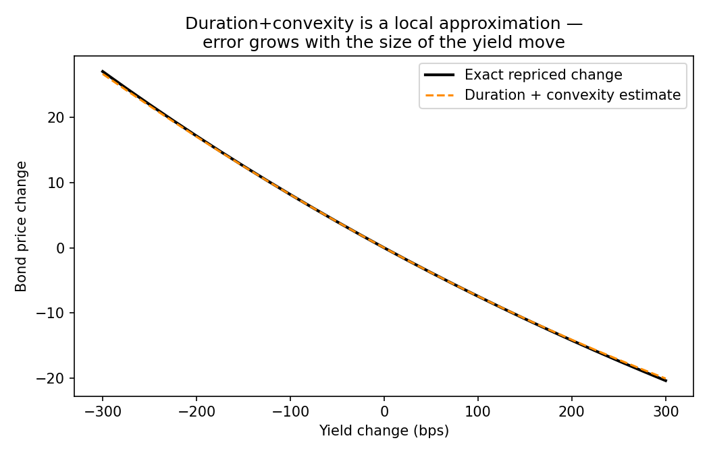
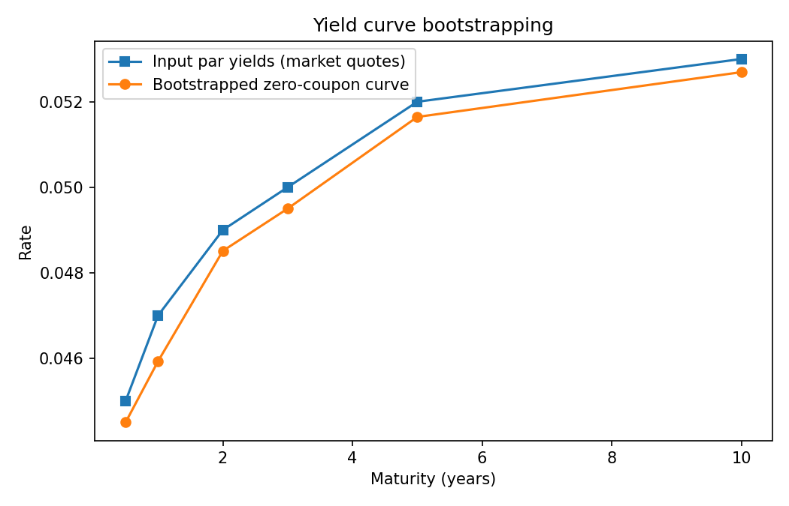
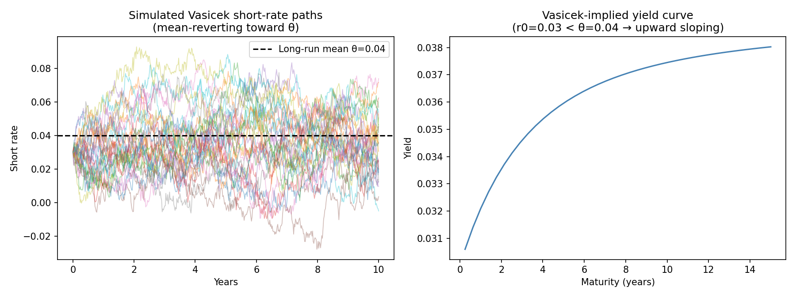

# Part C — Fixed Income & Rates

The lowest-priority part of this toolkit by design (per the build order in
the top-level README) — breadth beyond equity derivatives and portfolio risk,
built after the higher-priority parts were solid. Bond pricing and risk,
yield curve bootstrapping, and a short-rate model, each cross-checked the
same way every other module in this repo is: two independent ways of
computing the same number, checked against each other.

## Bond pricing, duration, convexity (`bonds.py`)

Standard discounted-cash-flow bond pricing, plus Macaulay/modified duration
and convexity. The useful thing to actually demonstrate here isn't the
formulas — it's that **duration+convexity is a local (second-order Taylor)
approximation of a truly convex price-yield relationship**, so its accuracy
degrades as the yield move gets larger:



For a 10y 5% semi-annual bond priced at par, the duration+convexity estimate
matches the exact repriced value almost perfectly for small moves and
visibly diverges at the ±300bp extremes — `tests/test_bonds.py` checks this
directly (the approximation error at a larger yield move must exceed the
error at a smaller one), not just that the numbers are "close enough."

## Yield curve bootstrapping (`yield_curve.py`)

Bootstraps a zero-coupon curve from a small set of par-bond market quotes —
the standard method: given zero rates for all shorter maturities, each new
instrument's own cash flows can be discounted except for its final payment,
leaving exactly one unknown (that maturity's zero rate) to solve for
algebraically.



The bootstrapped zero curve sits below the input par curve at every
maturity — the correct, well-known relationship for an upward-sloping curve
(zero rates below par yields; the reverse holds for an inverted curve).
`tests/test_yield_curve.py` re-prices every input instrument off the
bootstrapped curve and checks it recovers ~par (100) — small residuals of a
few cents are expected from linearly interpolating zero rates at
in-between coupon dates, not a bootstrapping bug, and the test tolerance
(0.1) reflects that honestly rather than hiding it behind a looser check.

## Vasicek short-rate model (`short_rate.py`)

`dr = kappa(theta - r) dt + sigma dW` — mean-reverting, Gaussian short rate,
with a genuine closed-form zero-coupon bond price. Simulated paths and the
resulting implied yield curve, starting below the long-run mean (so mean
reversion pulls future short rates up, producing an upward-sloping curve):



**A limitation worth naming, visible directly in the left panel**: because
the short rate is Gaussian, it can go negative (one simulated path above
dips below zero) — a well-known Vasicek weakness. The CIR model (`sqrt(r)`
in the diffusion term instead of a constant) fixes this by construction but
isn't implemented here, in keeping with this being the lowest-priority,
breadth-oriented part of the toolkit.

`tests/test_short_rate.py::test_closed_form_matches_monte_carlo` is the
module's real correctness check: the closed-form bond price and a full
Monte Carlo simulation of the short rate (discounting along each simulated
path) agree to within the Monte Carlo standard error — the same
cross-validation pattern as Part A's tree-vs-PDE check and Part B's
zero-jump-Merton-equals-Black-Scholes check.

## Running the tests and regenerating the figures

```bash
pip install -r requirements.txt
python -m pytest tests/test_bonds.py tests/test_yield_curve.py tests/test_short_rate.py -v
python -m fixed_income.generate_figures
```
