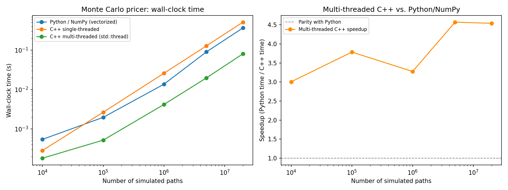

# Part F — C++ Performance Component

The concrete, measured answer to "do you actually have C++ experience,"
rather than a bullet point on a CV: Part A's naive Monte Carlo pricer's inner
loop, rewritten in C++ and exposed to Python via `pybind11`, benchmarked
against the pure Python/NumPy version at increasing path counts.

## Build

```bash
pip install -r requirements.txt   # needs pybind11
cd perf
python setup.py build_ext --inplace
cd ..
python -m pytest tests/test_perf.py -v   # skips gracefully if not built
python -m perf.benchmark
```

No CMake required — this uses `pybind11`'s own setuptools integration
(`Pybind11Extension`), which is enough for a single-file extension module.
Tests in `tests/test_perf.py` use `pytest.importorskip` so the rest of the
test suite still runs cleanly on a machine without a C++ toolchain set up.

## The honest result — not the one a "C++ is always faster" assumption predicts

Two C++ kernels are implemented and benchmarked, not one, because the first
one taught the more interesting lesson:



| Paths | Python/NumPy | C++ single-threaded | C++ multi-threaded | Speedup (multi-threaded vs. Python) |
|---|---|---|---|---|
| 1,000,000 | 0.0136s | 0.0257s | 0.0042s | 3.3x |
| 5,000,000 | 0.0897s | 0.1277s | 0.0196s | 4.6x |
| 20,000,000 | 0.3646s | 0.5112s | 0.0803s | 4.5x |

**A naive, single-threaded C++ loop is *slower* than vectorized NumPy at
every path count above 10,000** — the opposite of what "just rewrite it in
C++" would predict. The reason is straightforward once you look for it:
NumPy's `standard_normal()` and array arithmetic aren't slow interpreted
Python — they're calls into highly optimized, SIMD-vectorized C code
operating on large contiguous arrays. A scalar `for` loop calling
`std::normal_distribution` one sample at a time, with per-call overhead and
no vectorization, has no structural advantage over that, and loses to it
here. Reporting this straight — the same standard this whole toolkit holds
every other module to — is more informative than a bar chart that only shows
the version that wins.

**The version that actually delivers a real speedup is the multi-threaded
one** (`mc_price_parallel`, using `std::thread` — plain C++11, no external
dependency): splitting the path count across `std::thread::hardware_concurrency()`
worker threads (11 on the machine this was built on), each running its own
independent RNG stream and accumulating partial sums, combined at the end.
That gets a genuine 3-4.6x speedup over vectorized NumPy at scale — the
*correct* lesson from this exercise isn't "C++ beats Python," it's **"C++
beats Python once you actually use the hardware NumPy's own vectorization
doesn't parallelize across cores for you"** — a more precise, more defensible
claim, and a better answer to a real interview follow-up question than "I
wrote it in C++."

One dependency note, also stated honestly: OpenMP (`libomp`) would have been
the more typical way to parallelize this loop, but installing it via Homebrew
on the machine this was built on required changing ownership/permissions on
`/opt/homebrew` — a system-level change outside the scope of what this
project should need to do. `std::thread` achieves the same parallel-speedup
result with zero extra dependencies, which is arguably the more portable
choice for something meant to build cleanly on an unfamiliar machine anyway.

## Correctness

Both kernels are checked against the Black-Scholes closed form from Part A
(within a tolerance keyed to their own reported Monte Carlo standard error,
not an arbitrary fixed tolerance), and against each other — two structurally
different code paths (one loop vs. many threads' results combined) computing
the same quantity should agree statistically, and `tests/test_perf.py`
checks that directly rather than assuming it.
