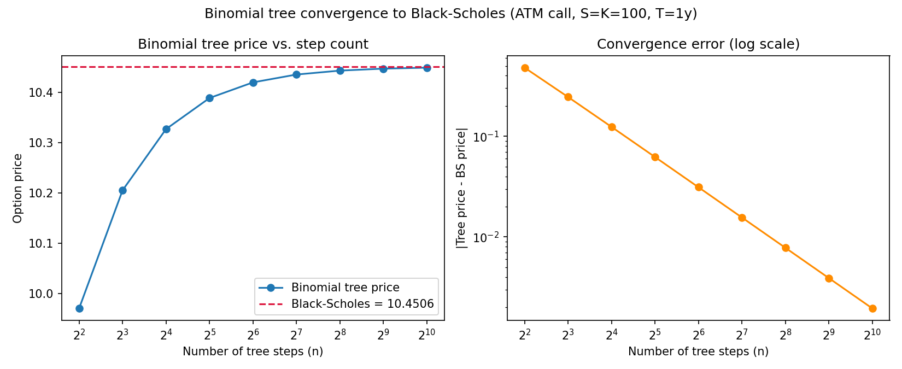
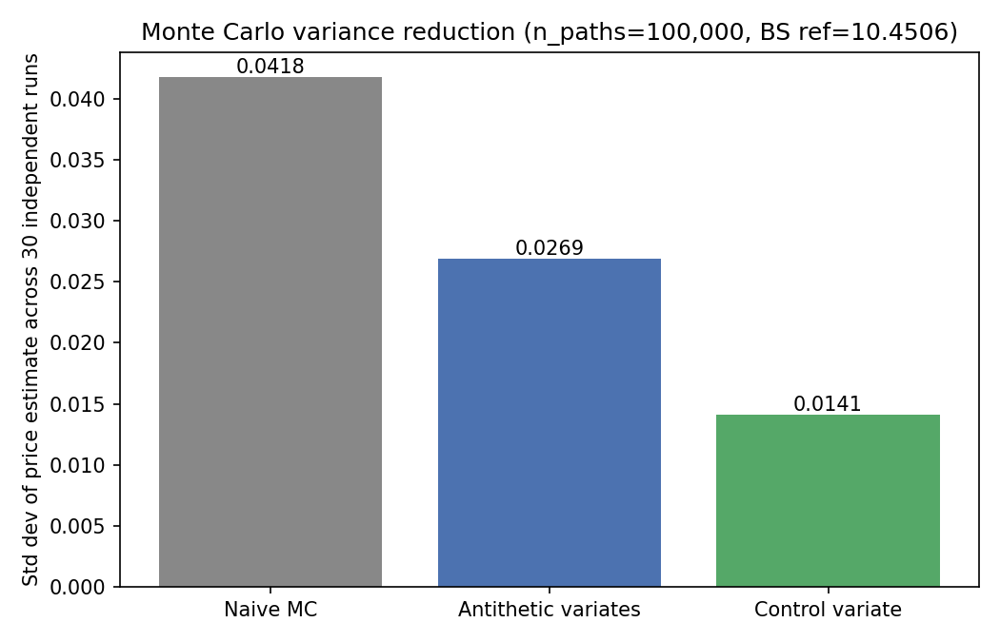

# Part A — Derivatives Pricing

Five pricing methods for the same underlying problem (a European or American
option on a single equity), each earning its place by doing something the
previous one can't: a closed-form formula, a discrete-time tree, simulation,
a PDE grid, and path-dependent payoffs simulation can price but a formula can't.

## Contents

| File | Method | Handles |
|---|---|---|
| `black_scholes.py` | Closed-form BSM | European vanilla calls/puts + Greeks |
| `binomial_tree.py` | CRR binomial tree | European *and* American vanilla calls/puts |
| `monte_carlo.py` | Monte Carlo (+ variance reduction) | European vanilla, any payoff you can simulate |
| `pde_solver.py` | Crank-Nicolson finite difference | European and American, via a full price *surface* |
| `exotics.py` | Monte Carlo | Path-dependent payoffs (barrier, Asian) |

## Model and assumptions

All five pricers assume the same underlying model unless stated otherwise:
the asset follows geometric Brownian motion with constant volatility, a
constant continuous risk-free rate, and a constant continuous dividend yield
— the standard Black-Scholes-Merton world. That's a strong assumption, and
**Part B (`advanced_models/`) exists specifically to show where it breaks**:
Black-Scholes implies a flat volatility surface, and real option chains
never look like that. See `advanced_models/README.md` for the Heston model's
implied volatility smile plotted directly against this module's flat one —
the same option chain, two models, one visibly wrong.

## Worked example

```python
from pricing.black_scholes import bs_price, bs_greeks

# Hull's textbook example: S=42, K=40, r=10%, sigma=20%, T=6 months
price = bs_price(S=42, K=40, T=0.5, r=0.10, sigma=0.20, option_type="call")
# -> 4.759 (textbook value: 4.76)

greeks = bs_greeks(S=100, K=100, T=1.0, r=0.05, sigma=0.20, option_type="call")
# BSResult(price=10.45, delta=0.637, gamma=0.019, vega=37.5, theta=-6.41, rho=53.2)
```

## Proof, not assertion: binomial tree convergence

The binomial tree is only worth trusting if it actually converges to the
closed-form price as steps increase. It does:



Error decays smoothly and monotonically (visible as a straight line on the
log-log error plot on the right) from a step-5 error of 0.36 down to 0.0025
at 800 steps. `tests/test_binomial_tree.py::test_convergence_to_black_scholes`
enforces both the final accuracy and the monotonic shrinkage as a real test,
not just a plot.

American vs. European, from the same tree: with no dividends, an American
call is never worth more than the European call (early exercise is never
optimal) — the tree reproduces this exactly. An American put, in contrast,
is worth strictly more (5.56 European vs. 6.09 American at S=K=100, r=5%,
σ=20%, T=1y) because early exercise of a put *can* be optimal.

## Proof, not assertion: Monte Carlo variance reduction

Naive Monte Carlo, antithetic variates, and a control variate (the terminal
asset price, whose risk-neutral mean is known exactly) are all implemented,
then compared on equal footing — same number of paths, 30 independent seeds
each, measuring the actual spread of the resulting price estimates:



| Estimator | Std dev across 30 runs (n=100,000 paths) | Reduction vs. naive |
|---|---|---|
| Naive MC | 0.0418 | — |
| Antithetic variates | 0.0269 | 36% |
| Control variate | 0.0141 | 66% |

`tests/test_monte_carlo.py::test_variance_reduction_actually_reduces_variance`
asserts this ordering holds, not just that the estimators exist.

## PDE solver — a simplification, stated honestly

`pde_solver.py` prices American options with a Crank-Nicolson finite-difference
scheme, enforcing early exercise by taking the elementwise max of the solved
value against the intrinsic payoff after each time step. This is a standard,
widely-used approximation — not a full linear-complementarity (PSOR) solve —
and it's accurate enough to agree with the binomial tree's American price to
within half a cent on a 300x300 grid (`tests/test_pde_solver.py`), but a
production system handling the free exercise boundary numerically would use
PSOR or an operator-splitting method instead.

## Exotics

`barrier_down_and_out_call` and `asian_arithmetic_call` both depend on the
whole simulated path, not just the terminal price — the reason they're
priced by Monte Carlo rather than a closed-form formula. Both come out
cheaper than the equivalent vanilla call, as they must (knockout risk;
averaging dampens the effective volatility that drives option value):

| S=K=100, T=1y, r=5%, σ=20% | Price |
|---|---|
| Vanilla call (Black-Scholes) | 10.45 |
| Down-and-out call, barrier=80 | ~10.38 |
| Arithmetic Asian call | ~5.9 |

One implementation note worth being explicit about: the down-and-out price
is sensitive to how finely the barrier is monitored in simulation (`n_steps`).
Coarser monitoring misses more barrier touches and biases the estimated price
*upward*, toward the vanilla price — a real, well-known discrete-monitoring
effect, not a modeling error. The tests use `n_steps=252` (daily monitoring
over a year) to keep this bias small.

## Running the tests and regenerating the figures

```bash
pip install -r requirements.txt
python -m pytest tests/test_black_scholes.py tests/test_binomial_tree.py \
    tests/test_monte_carlo.py tests/test_pde_solver.py tests/test_exotics.py -v
python -m pricing.generate_figures
```
