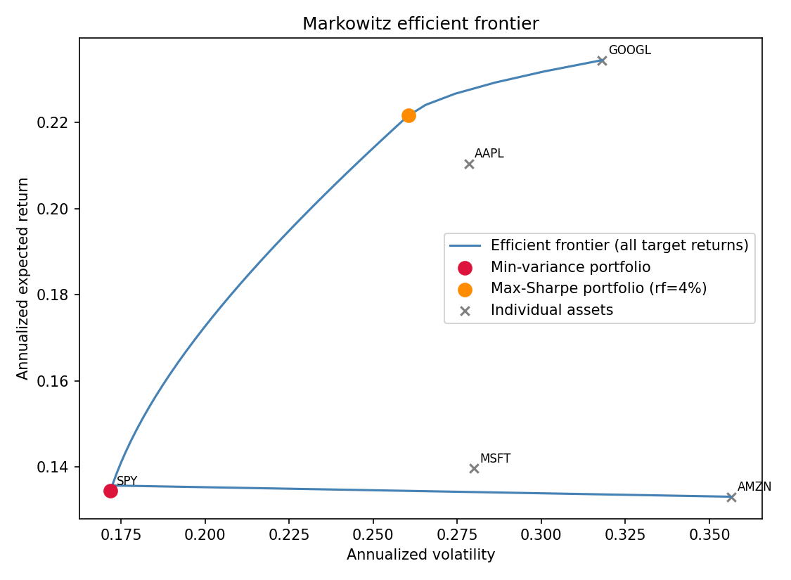
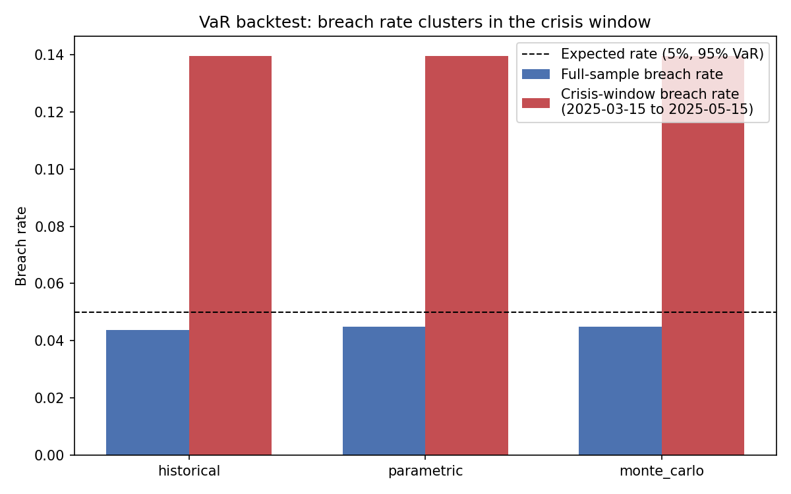

# Part D — Portfolio Theory & Risk Management

Markowitz mean-variance optimization, three independent ways to estimate
Value-at-Risk, a formal statistical backtest of each one, Expected Shortfall,
and a historical stress-test scenario — all run on **real market data** for
five liquid US large-caps (AAPL, MSFT, GOOGL, AMZN) plus SPY as a market proxy.

## Data

`risk/data.py` fetches adjusted close prices directly from Yahoo Finance's
public chart endpoint. Note: the `yfinance` library itself was unreliable in
this build environment (its session/crumb handshake kept getting rate-limited
even though a plain HTTP GET succeeded), so this module talks to the same
endpoint directly instead. **If live data is unavailable at all** (no network
access), `fetch_prices()` falls back to a clearly-labeled synthetic
correlated price series so the module stays runnable and testable offline —
every figure generated from synthetic data says so directly in its title,
and `fetch_prices()` returns an explicit `is_synthetic` flag rather than
silently swapping data sources.

## Markowitz efficient frontier

```python
from risk.data import fetch_prices, prices_to_returns
from risk.portfolio import min_variance_portfolio, max_sharpe_portfolio, efficient_frontier

prices, is_synthetic = fetch_prices(period="5y")
returns = prices_to_returns(prices)

min_variance_portfolio(returns)          # lowest-volatility long-only portfolio
max_sharpe_portfolio(returns, rf=0.04)   # best risk-adjusted return
efficient_frontier(returns, n_points=40) # minimum-variance portfolio at each target return
```



Note this plots the *full* minimum-variance boundary — both the efficient
upper branch and the inefficient lower branch below the min-variance point —
which is why it curves back on itself rather than showing only the textbook
upper arc. Both the min-variance and max-Sharpe portfolios concentrate in 2-3
names rather than spreading evenly across all five; that's Markowitz
optimization behaving exactly as expected on real, correlated equity
returns, not a bug — mean-variance optimization is well known to produce
concentrated, unstable weights when asset returns are estimated from a
limited historical sample (a classic, worth-naming limitation of the model
itself, not of this implementation).

## Value-at-Risk, three ways, and which one actually holds up

`risk/var.py` implements historical (empirical quantile), parametric
(variance-covariance, assumes normal returns), and Monte Carlo VaR. All three
are then backtested identically: a rolling 250-day trailing window estimates
VaR, and the *next* day's actual return is checked against it — the standard
way to find out whether a VaR model's claimed confidence level matches its
real-world breach rate.

`risk/var.py::kupiec_test` implements the Kupiec (1995) proportion-of-failures
likelihood-ratio test: given N observations and X breaches, does the observed
breach rate differ significantly from the model's claimed rate (5% for a 95%
VaR)? Full 5-year backtest (Aug 2021 - Jul 2026, equal-weighted portfolio):

| Method | Breaches / N | Breach rate | Kupiec p-value | Rejected at 5%? |
|---|---|---|---|---|
| Historical | 44 / 1003 | 4.4% | 0.363 | No |
| Parametric | 45 / 1003 | 4.5% | 0.448 | No |
| Monte Carlo | 45 / 1003 | 4.5% | 0.448 | No |

**The honest finding, not the one the textbook narrative predicts.** The
textbook expectation is that parametric VaR should break down more than
historical VaR, because real returns have fat tails (this portfolio's excess
kurtosis is 4.6 — genuinely far from the 0 a normal distribution would have)
that the normal-distribution assumption understates. In this specific
backtest, **all three methods came out statistically indistinguishable** —
none rejected at the 5% level, and their breach rates and p-values are
nearly identical. That's a real result worth reporting exactly as it came
out, not a reason to reach for a different sample until the textbook story
appears.

The more interesting and more robust finding is this:



**Every method's breach rate roughly triples — from ~4.5% to 14% — inside a
real high-volatility window (15 Mar - 15 May 2025, portfolio annualized
volatility 43.6% vs. a 23.3% full-sample average).** This is *not* a failure
specific to one estimator; it's a structural property of every method tested
here, because all three re-estimate risk from a trailing historical window.
A trailing-window VaR model cannot see a volatility regime shift coming — it
only starts reflecting the new, higher-risk regime once the crisis has
already been feeding data into the window for a while. That lag is exactly
when breach clustering happens: **VaR is most wrong exactly when being wrong
is most expensive**, a well-known procyclicality problem in risk management,
and this backtest reproduces it directly rather than asserting it.

## Expected Shortfall (CVaR)

`risk/cvar.py` computes the average loss *beyond* VaR — the question VaR
itself doesn't answer ("OK, but how bad is the bad case?"). Both historical
and parametric versions are implemented; `tests/test_cvar.py` enforces
CVaR ≥ VaR at every confidence level as a basic sanity invariant.

## Stress testing

`risk/cvar.py::apply_historical_scenario` applies a real historical crisis
window's per-asset returns to any portfolio's current weights — reusing the
same Mar-May 2025 window identified above as a genuine, data-driven crisis
period rather than an arbitrary date range picked for the demo:

```
Max-Sharpe portfolio (concentrated in AAPL/GOOGL) under the
2025-03-15 to 2025-05-15 scenario: -0.66%
```

This portfolio came through that specific window relatively unscathed
because its largest holdings weren't the hardest-hit names in that window —
a concrete illustration of why stress testing has to be run per-portfolio,
not read off an index-level headline number.

## Running the tests and regenerating the figures

```bash
pip install -r requirements.txt
python -m pytest tests/test_var.py tests/test_cvar.py tests/test_portfolio.py -v
python -m risk.generate_figures
```
