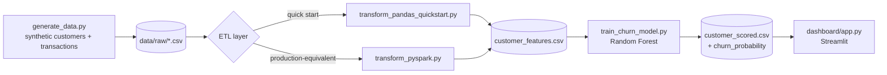

# RetailPulse — Customer Intelligence PoC

A self-contained data & AI proof-of-concept, built the way a Data/AI Presales
Engineer would scope and deliver a first demo for a prospective client:
synthetic dataset → PySpark ETL → churn-risk ML model → an interactive
dashboard you can present live.

**Why this project exists:** Singapore's data-AI presales postings (Azendian,
NTT DATA, Accenture, Databricks) consistently ask for the same thing — SQL/Python,
a modern data platform (Spark/Databricks), ML fundamentals, and *the ability to
build a PoC and present it to both business and technical audiences*. This repo
is that PoC.

---

## The business narrative

> RetailPulse is a fictional e-commerce retailer selling across Singapore,
> Malaysia, Indonesia, and Thailand through online and in-store channels.
> Leadership wants to know: **which customers are at risk of churning, and
> where is revenue actually concentrated** — so the growth team can prioritise
> retention spend instead of guessing.

All data is synthetic (see `data/generate_data.py`) — no real customer data
is used anywhere in this project.

---

## Architecture



Two ETL paths produce an **identical output schema** on purpose:
- `transform_pandas_quickstart.py` — runs in seconds, zero setup, good for a quick local demo.
- `transform_pyspark.py` — the version to actually talk through in an interview: same RFM logic, expressed as a Spark job the way a client's data platform team (Databricks/EMR) would expect it.

---

## Quick start (2 minutes, no Spark needed)

```bash
git clone <your-repo-url>
cd sg-data-ai-demo
pip install -r requirements.txt

python data/generate_data.py                  # generates raw/customers.csv, raw/transactions.csv
python etl/transform_pandas_quickstart.py      # builds the RFM feature table
python ml/train_churn_model.py                 # trains the churn model, scores all customers
streamlit run dashboard/app.py                 # opens the dashboard in your browser
```

## Production-equivalent path (what to describe in an interview)

```bash
# Requires Java 8/11/17 + pyspark installed, or run this on Databricks
# Community Edition (free) by uploading data/raw/*.csv to a Volume.
python etl/transform_pyspark.py
```

This writes a **partitioned Parquet** feature table instead of a flat CSV —
closer to what you'd actually hand off to a client's analytics team.

---

## What's in each layer

| Layer | File | What it demonstrates |
|---|---|---|
| Data generation | `data/generate_data.py` | Realistic synthetic dataset design (segment-weighted purchase behaviour, category price ranges) |
| ETL | `etl/transform_pyspark.py`, `etl/transform_pandas_quickstart.py` | RFM feature engineering, data-quality handling, PySpark window functions |
| ML | `ml/train_churn_model.py` | Supervised classification, feature importance, **deliberate data-leakage avoidance** (see below) |
| Dashboard | `dashboard/app.py` | KPI reporting, filterable charts, per-customer drill-down — a live-demo-ready PoC |

---

## A design decision worth mentioning in interviews

Churn is defined as *"no purchase in 90 days, having purchased before."*
The first version of the model included `recency_days` as a training feature —
and scored **100% accuracy**. That's a classic **data leakage** bug: the label
is literally a threshold on `recency_days`, so the model was just re-learning
the threshold, not predicting anything.

Fix: `recency_days` was removed from the model's feature set (it's still
shown on the dashboard as a business metric — just not fed to the model), and
`tenure_days` (signup age) was added instead. Result: a believable
**74.5% accuracy / 0.78 ROC-AUC**, with `frequency` and `categories_purchased`
as the top real churn drivers.

This is a better interview story than a clean build — it shows you can catch
and reason about a leakage bug, not just run `.fit()`.

---

## Mapping this project to what employers actually ask for

| Job requirement (from real SG postings) | Where it's shown here |
|---|---|
| "SQL, Python for statistical programming, data visualisation, machine learning" — Azendian Presales Solutions Engineer | `ml/train_churn_model.py`, `dashboard/app.py` |
| "Hands-on experience with modern data/AI platforms (Databricks, Snowflake)" — NTT DATA Presales Architect | `etl/transform_pyspark.py` |
| "Ability to build PoCs and present to business and technical audiences" — multiple postings | `dashboard/app.py` + the demo script below |
| "Deep AI/ML and data-analytics-platform expertise" — Accenture AI & Data Pre-Sales | Feature engineering + churn model + leakage fix write-up |

---

## Running this as an actual demo (talking points)

1. Open with the business problem, not the tech: *"RetailPulse doesn't know who's about to churn, so retention spend is a guess."*
2. Show the KPI row → filter by country → show the revenue chart. Ground it in something a stakeholder cares about before touching ML.
3. Move to the churn section — explain the risk bands, then show the feature-importance chart: *"frequency and category breadth matter more than how much they've spent."*
4. Pull up one customer live in the lookup tool. Concrete example > abstract metrics.
5. If asked "how would this differ for a real client?" — talk about the leakage fix, data-quality/governance steps you'd add (see `etl/transform_pyspark.py` comments), and how you'd validate the churn definition with the client's own business rules instead of assuming 90 days.

---

## Possible extensions

- Swap the Random Forest for a simple **GenAI layer**: a RAG chatbot that
  answers "why is customer X flagged as high risk?" in plain language over
  this same dataset (natural next portfolio project).
- Deploy the dashboard (Streamlit Community Cloud is free) so it's a live
  link in your resume, not just a repo.
- Add a second ML task (e.g. next-purchase category prediction) to show
  breadth beyond churn.

---

## Disclaimer

All data in this repository is synthetically generated for demonstration
purposes. No real customer, transaction, or company data is used.
